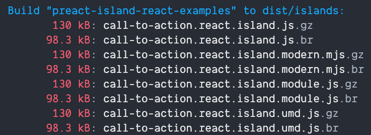
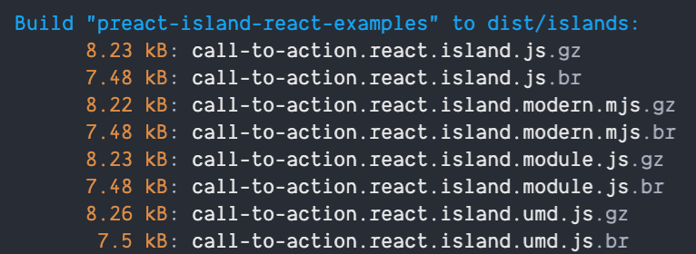
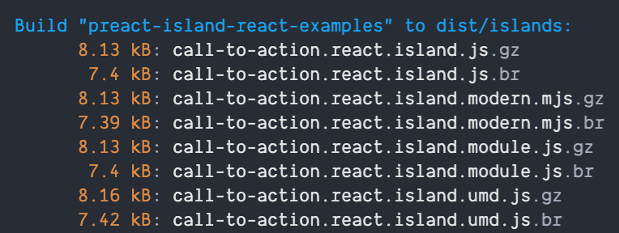

<div align="center">
  
</div>
<div align="center">
  <h1 align="center">🏝 Preact Island</h1>
  <p align="center">
    A 1.3kB module that helps you ship your own slice of paradise to any website. Especially useful for Shopify apps or CMS websites.
  </p>

[![downloads][downloads-badge]][npmcharts]
[![version][version-badge]][package]
[![Supports Preact and React][preact-badge]][preact]
[![MIT License][license-badge]][license]

</div>

Sometimes you need to embed a component onto someone else's website. This could be a Shopify widget, email sign up form, CMS comment list, social media share icon, etc. Creating these experiences are tedious and difficult because you aren't in control of the website your code will be executed on.

Preact Island helps you build these experiences by adding a lightweight layer on top of Preact. For <5kB, you get a React style workflow (with hooks!), and a framework for rendering your widget with reactive props.

## Features

- 🚀 Render by selector, inline, or by a specific attribute given on the executed script
- ⚛️ Based on Preact, no special compiler or anything needed to render an island
- 🙏 5 ways to pass in props to your component
- 🪄 All components are reactive to prop changes causing rerenders (not remounts)
- 👯‍♀️ Create as many instances of your component as you need with a single island
- 🧼 Does not mutate the `window`. Use as many islands as you'd like on one page!
- 🐣 Less than 1.3kB
- ☠️ Supports replacing the target selector
- 🏔 React friendly with `preact-compat`
- 🔧 Manually trigger rerenders with props
- 🐙 Fully tested with Preact testing library
- 👔 Fully typed with TypeScript

## Examples

- [Basic element placement with props](https://codesandbox.io/s/preact-island-element-placement-with-props-8kzmj5)
- [Reactive props](https://codesandbox.io/s/reactive-prop-updates-uqvof7)
- [Multiple islands](https://codesandbox.io/s/multiple-islands-8xvjqw)
- [Props script](https://codesandbox.io/s/props-selector-70ks1g)
- [Replace selector](https://codesandbox.io/s/replace-selector-z2rogw)
- [Multiple host elements](https://codesandbox.io/s/multiple-host-elements-q6ot5q)
- [Clean host element](https://codesandbox.io/s/clean-host-element-i35nlt)
- [Global island](https://codesandbox.io/s/global-island-zqco9p)
- [Inline script](https://codesandbox.io/s/inline-script-1qm5q8)
- [Executed script props](https://codesandbox.io/s/preact-island-element-placement-current-script-props-0dwlyo)
- [Interior script props](https://codesandbox.io/s/interior-script-props-z5rcxg)
- [Mount In script attribute](https://codesandbox.io/s/mount-in-property-z5rcxg)

## Installation

```sh
npm install --save preact-island
```

## Usage

```tsx
import { h } from 'preact'
import { createIsland } from 'preact-island'

const Widget = () => {
  return <div>awesome widget!</div>
}

const island = createIsland(Widget)
island.render({
  selector: '[data-island="widget"]',
})
```

## API

### createIsland

Creates a new island instance with a passed in component. Returns a bag of props/methods to work with your island.

```tsx
import { createIsland } from 'preact-island'

const Widget = () => {
  return <div>awesome widget!</div>
}

const island = createIsland(Widget)
```

### createIsland().render

Renders an island to the DOM given options.

```ts
const island = createIsland(Widget)
island.render({...})
```

#### options

````ts
  /**
   * A query selector target to create the widget. This is ignored if inline is passed or if a `data-mount-in` attribute
   * is appended onto the executed script.
   *
   * @example '[data-island="widget"]'
   */
  selector?: string
  /**
   * If true, removes all children of the element before rendering the component.
   *
   * @default false
   *
   * @example
   * ```html
   * <div data-island="widget">
   *    <div>some other content</div>
   *    <div>some other content</div>
   *    <div>some other content</div>
   * </div>
   * ```
   *
   * // turns into
   *
   * ```html
   * <div data-island="widget">
   *    <div>your-widget</div>
   * </div
   * ```
   */
  clean?: boolean
  /**
   * If true, replaces the contents of the selector with the component given. If you use replace,
   * you will not be able to add props to the host element (since it will be replaced). You will also
   * not be able to use child props script either (since they will be replaced).
   *
   * Use script tag props or a props selector for handling props when in replace mode.
   *
   * @default false
   *
   * @example
   * ```html
   * <div data-island="widget"></div>
   * ```
   *
   * // turns into
   *
   * ```html
   * <div>your-widget</div>
   * ```
   */
  replace?: boolean

  /**
   * Renders the widget at the current position of the script in the HTML document.
   *
   * @default false
   *
   * @example
   * ```html
   * <div>
   *    <div>some content here</div>
   *    <script src="https://preact-island.netlify.app/islands/pokemon.inline.island.umd.js"></script>
   *    <div>some content here</div>
   * </div>
   * ```
   *
   * // turns into
   *
   * ```html
   * <div>
   *    <div>some content here</div>
   *    <script src="https://preact-island.netlify.app/islands/pokemon.inline.island.umd.js"></script>
   *    <div>your widget</div>
   *    <div>some content here</div>
   * </div>
   * ```
   */
  inline?: boolean
  /**
   * Initial props to pass to the component. These props do not cause updates to the island if changed. Use `createIsland().rerender` instead.
   */
  initialProps?: P
  /**
   * A valid selector to a script tag located in the HTML document with a type of either `text/props` or `application/json`
   * containing props to pass into the component. If there are multiple scripts found with the selector, all props are merged with
   * the last script found taking priority.
   */
  propsSelector?: string
````

### createIsland().rerender

Triggers a rerenders of the island with the new props given.

```ts
const island = createIsland(Widget)
island.render({ selector: '[data-island="widget"]' })
island.rerender({ new: 'props' })
```

### createIsland().destroy

Destroys all instances of the island on the page and disconnects any associated observers.

```ts
const island = createIsland(Widget)
island.render({ selector: '[data-island="widget"]' })
island.destroy()
```

## Selecting Mount Point from Script

You can override the `selector` given to render by passing `data-mount-in` to the script.

[Example](https://codesandbox.io/s/mount-in-property-z5rcxg)

```html
<div data-island="pokemon">
  <script type="text/props">
    {"pokemon": "3"}
  </script>
</div>
<h2>Special mount</h2>
<!-- This takes priority over the other placement -->
<!-- Props are scoped to placement so that's why -->
<!-- Venosaur (pokemon number 3) doesn't appear -->
<div data-island="mount-here-actually"></div>

<script
  async
  data-mount-in='[data-island="mount-here-actually"]'
  src="https://preact-island.netlify.app/islands/pokemon.island.umd.js"
></script>
```

## Passing Props

Props can be passed to your widget various ways. You can choose to pass props multiple different ways to your island where they'll be merged in a defined order.

### Merging Order

Props are merged in the following order (from lowest to highest specificity):

1. Initial props
2. Element props
3. Executed script props
4. Props selector props
5. Interior script props

### Data Props

All props located on an HTML element use `data-`. You can name them any of the following ways:

- `data-background-color` => `backgroundColor`
- `data-prop-background-color` => `backgroundColor`
- `data-props-background-color` => `backgroundColor`

Under the hood all of these element will be transformed to `camelCase` and passed to your component.

### Initial Props

Default props can be passed on render to an island. You can render many islands and give them all different initial props. Initial props
do not cause rerenders if updated. Use `createIsland.rerender` instead.

```ts
import { h } from 'preact'
import { createIsland } from 'preact-island'

const Widget = () => {
  return <div>awesome widget!</div>
}

const island = createIsland(Widget)

island.render({
  selector: '[data-island="widget"]',
  initialProps: {
    color: '#000000',
  },
})

island.render({
  selector: '[data-island="widget"]',
  initialProps: {
    color: '#ffffff',
  },
})

// Will render two instances of the island with different color props
```

### Element Props

Props can be placed on host elements and passed to your component. These props are reactive and will cause rerenders on changes.

[Example](https://codesandbox.io/s/preact-island-element-placement-with-props-8kzmj5)

```html
<div data-island="pokemon" data-pokemon="130"></div>
<script
  async
  src="https://preact-island.netlify.app/islands/pokemon.island.umd.js"
></script>
```

### Executed Script Props

Props can be placed on the script tag that's evaluated to the create your island. These props are reactive and will cause rerenders on changes.

[Example](https://codesandbox.io/s/preact-island-element-placement-current-script-props-0dwlyo)

```html
<div data-island="pokemon"></div>
<script
  data-pokemon="130"
  async
  src="https://preact-island.netlify.app/islands/pokemon.island.umd.js"
></script>
```

### Props Selector Props

Props can be placed inside of a `<script>` and targeted with a given selector. These props are reactive and will cause rerenders on changes. If there are multiple scripts found with the selector, all props are merged with the last script found taking priority.

[Example](https://codesandbox.io/s/props-selector-70ks1g)

```tsx
const island = createIsland(Pokemon)
island.render({
  selector: '[data-island="pokemon"]',
  // Make sure you set this in your island's render method!
  propsSelector: '[data-island-props="test-island"]',
})
```

```html
<div data-island="pokemon"></div>

<!-- Can be located anywhere in the document! -->
<script data-island-props="test-island" type="text/props">
  {"pokemon": "3"}
</script>

<script
  async
  src="https://preact-island.netlify.app/islands/pokemon.props-selector.island.umd.js"
></script>
```

### Interior Script Props

Props can be placed inside of a `<script>` and nested instead of a selector. These props are reactive and will cause rerenders on changes. If
multiple interior script props are found, all props are merged with the last script found taking priority.

[Example](https://codesandbox.io/s/interior-script-props-z5rcxg)

```html
<div data-island="pokemon">
  <script type="text/props">
    {"pokemon": "3"}
  </script>
</div>

<script
  async
  src="https://preact-island.netlify.app/islands/pokemon.island.umd.js"
></script>
```

## React Compatibility

Preact Island fully supports React using [preact/compat](https://preactjs.com/guide/v10/switching-to-preact). This allows you to bring your existing React components over to Preact to get great performance gains without needing to rewrite your components. Check out the `example-react` folder to a demo repo that reproduces some of the Preact islands as React islands.

Depending on what you import from React, using Preact + Preact Island can result in a **15x smaller bundle** for the same functionality and no code changes needed on your end.

### Bundle Sizes

#### React



#### React + Preact/compat



#### Preact



## Adding Styles

You can add styles to your island just like any other component. If you're island will be running on someone else's website be mindful of the global CSS scope! Preact Island does not render into the shadow dom (yet) so your styles will impact the entire page. Prefix all of your classes with a name `island__` or use CSS modules to make sure those styles don't leak. Do not use element selectors like `p` or `h2`.

### Including Styles

Preact Island takes no opinions on how CSS is included for your islands. There are two main options:

**Inline the CSS into the bundle**

This is what the `/example` islands do.

```tsx
import { createIsland } from '../../dist/index.module'
import { h } from 'preact'
import style from './email-subscribe.island.css'

document.head.insertAdjacentHTML('beforeend', `<style>${style}</style>`)

const Widget = () => {
  return (
    <div className="email__container">
      <p className="email__title">Join our newsletter</p>
      {/* ... */}
    </div>
  )
}

const island = createIsland(Widget)
island.render({
  selector: '[data-island="email-subscribe"]',
})
```

```html
<script
  src="https://your-domain/snippets/fancy-widget.island.umd.js"
  async
></script>
```

**Pros:**

- The consumer of the script doesn't need to include an external stylesheet
- There's only one request for rendering the entire widget

**Cons:**

- Bloats the bundle
- The CSS file itself won't be able to be cached

**Use an external stylesheet**

```html
<!-- Start island -->
<link
  href="https://your-domain/snippets/fancy-widget.island.css"
  rel="stylesheet"
/>
<script
  src="https://your-domain/snippets/fancy-widget.island.umd.js"
  async
></script>
<!-- End island -->
```

**Pros:**

- The CSS can be cached in the browser
- Doesn't bloat the JS bundle

**Cons:**

- Unless your script creates an element to automatically request the stylesheet the consumer of your script will need to add two things not one

### CSS Libraries

It's not recommending to use CSS libraries when developing islands since they're meant to be small and ran everywhere. Some libraries come with opinionated CSS resets and other global CSS styles that could break the consuming website of your island. They are also going to be large.

If you need a CSS library, use something that has a just in time compilation step like [Tailwind](https://tailwindcss.com/docs/installation) to minimize the excess CSS.

## Building Your Islands

Any modern bundler will work with Preact Island. If you are looking for a script that will run on a webpage you need the `UMD` format. The `/example` project has a demo setup using `microbundle`, a bundler by the same author as Preact. It works extremely well if you have multiple islands because it can produce multi-entry point bundles.

### Naming Conventions

Make sure to name your bundles `kebab-case` since they'll be served over HTTP. Case sensitive URLs can be fiddly depending on browser!

## Hosting Your Islands

You can host your files on anywhere you would typically host websites. Vercel, Cloudflare Workers, and Netlify all work great. Netlify recently [changed their prices](https://answers.netlify.com/t/upcoming-changes-to-netlify-plans/52482/158) causing it to be prohibitively expensive depending on your team size.

## The Callsite for Your Island

When you are consuming the bundled snippet it's important not to block rendering on a consuming page. When a browser loads a webpage and sees a `script` tag it executes that script immediately blocking render. Islands should be independent of the consuming page so it is safe to use the `async` property. See [async vs defer](https://javascript.info/script-async-defer) for more information.

> The only exception to this is if you are putting the island on the window and want to run a script after it. Check out [global island](https://codesandbox.io/s/global-island-zqco9p) for an example.

Do this:

```html
<script
  src="https://your-domain/snippets/fancy-widget.island.umd.js"
  async
></script>
```

Not this:

```html
<script src="https://your-domain/snippets/fancy-widget.island.umd.js"></script>
```

## Differences to Preact Habitat

This library was heavily inspired by [Preact Habitat](https://github.com/zouhir/preact-habitat).

Key differences:

- Components rerender based on prop changes. This can be a `data-prop` attribute change on a host element, inside of a props script tag, or event on the executed script.
- You can add props to script element itself and they're passed to the component
- You can add props to a script tag that lives anywhere in the document and sync it up to the component
- You can replace the target container instead of rendering inside of it if you choose
- No double loading when mounting the component
- Calling render multiple times create many components
- There is a `rerender` method that allows you to manually alter props for the component
- All dataset attributes (`data-` on an element) are passed as props
- There is no `clientSpecified` flag. If you declare a `data-mount-in` prop on a script it will take priority over the `selector` given at `render`.

## Alternatives

- [StencilJS](https://stenciljs.com/): A web components toolchain that feels sort of like React and Angular put together. The JSX core is lifted from Preact's internals. It has a lot of nice features like automatic documentation and other nice to haves since it has its own compiler. It feels tailored towards design system and doesn't have the flexibility of prop injection that Preact Island does. It's also another tool to adopt with it's own patterns. All you have to do with Preact Island is bring your component.
- [Lit](https://lit.dev/docs/): A web components framework by Google. Does not require a compilation step and weights in around 5Kb (roughly the same as Preact Island + Preact). Doesn't use a virtual dom for diffing and feels like a nice layer on top of web components. Does not support JSX or a React style workflow.

Preact Island does not leverage the shadow dom or custom elements API yet for building full fledged [web components](https://developer.mozilla.org/en-US/docs/Web/Web_Components). It may at some point in the future, but the scope of the project is to deliver the best React style API for delivering one of widgets onto any web page under 5kB.

## Credits

A huge thank you to [zouhir](https://github.com/zouhir) who is the author of [preact-habitat](https://github.com/zouhir/preact-habitat). This library is heavily inspired by his work on that library.

Artwork by [vik4graphic](https://lottiefiles.com/vik4graphic)

## License

[MIT](LICENSE) - Copyright (c) [Marcus Wood](https://www.marcuswood.io/)

To add dynamic props to replace you can add a script in the document and pass in `data-props-for` or you can add props inline to the script placed on the page.

[version-badge]: https://img.shields.io/npm/v/preact-island.svg?style=flat-square
[package]: https://www.npmjs.com/package/preact-island
[downloads-badge]: https://img.shields.io/npm/dm/preact-island.svg?style=flat-square
[npmcharts]: http://npmcharts.com/compare/preact-island
[license-badge]: https://img.shields.io/npm/l/preact-island.svg?style=flat-square
[license]: https://github.com/mwood23/preact-island/blob/master/LICENSE
[preact-badge]: https://img.shields.io/badge/%E2%9A%9B%EF%B8%8F-preact-6F2FBF.svg?style=flat-square
[preact]: https://preactjs.com
[module-formats-badge]: https://img.shields.io/badge/module%20formats-umd%2C%20cjs%2C%20es-green.svg?style=flat-square
[github-star]: https://github.com/mwood23/preact-island/stargazers
